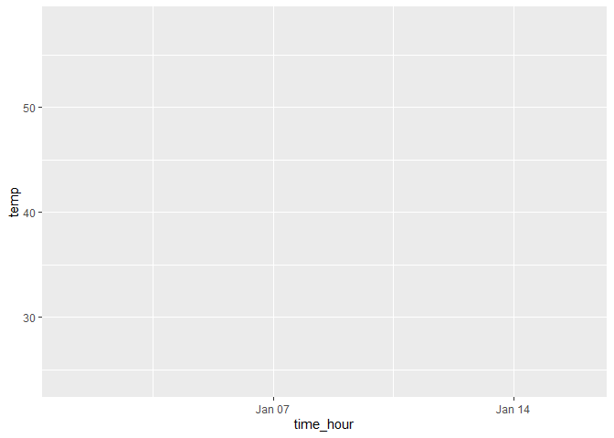

p8105_hw1_csl2209
================
Casandra Laney
2025-09-20

## Problem 1

Let’s import the dataset and load the package

``` r
library(tidyverse)
```

    ## ── Attaching core tidyverse packages ──────────────────────── tidyverse 2.0.0 ──
    ## ✔ dplyr     1.1.4     ✔ readr     2.1.5
    ## ✔ forcats   1.0.0     ✔ stringr   1.5.1
    ## ✔ ggplot2   3.5.2     ✔ tibble    3.3.0
    ## ✔ lubridate 1.9.4     ✔ tidyr     1.3.1
    ## ✔ purrr     1.1.0     
    ## ── Conflicts ────────────────────────────────────────── tidyverse_conflicts() ──
    ## ✖ dplyr::filter() masks stats::filter()
    ## ✖ dplyr::lag()    masks stats::lag()
    ## ℹ Use the conflicted package (<http://conflicted.r-lib.org/>) to force all conflicts to become errors

``` r
library(moderndive)

data("early_january_weather")
```

The dataset ‘early_january_weather’ contains 15 variables of weather
data collected at EWR.

Important variables include:

- ‘temp’: the temperature in F.

- ‘wind_dir’: direction of the wind in degrees

- ‘wind_speed’: speed of the wind in mph

- ‘wind_gust’: gust speed of wind in mph

- ‘precip’: the precipitation in inches

- ‘time_hour’: the date and hour of the recording

The dataset has 15 columns and and 358 rows.

The mean temperature is 39.5821229.

``` r
ggplot(early_january_weather, aes(x = time_hour, y = temp))
```

<!-- -->
