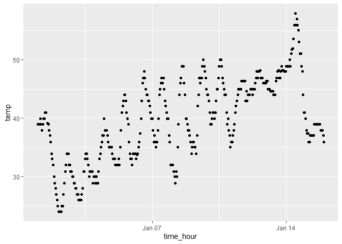

p8105_hw1_csl2209
================
Casandra Laney
2025-09-20

## Problem 1

Let’s import the dataset and load the package

``` r
library(tidyverse)
```

    ## ── Attaching core tidyverse packages ──────────────────────── tidyverse 2.0.0 ──
    ## ✔ dplyr     1.1.4     ✔ readr     2.1.5
    ## ✔ forcats   1.0.0     ✔ stringr   1.5.1
    ## ✔ ggplot2   3.5.2     ✔ tibble    3.3.0
    ## ✔ lubridate 1.9.4     ✔ tidyr     1.3.1
    ## ✔ purrr     1.1.0     
    ## ── Conflicts ────────────────────────────────────────── tidyverse_conflicts() ──
    ## ✖ dplyr::filter() masks stats::filter()
    ## ✖ dplyr::lag()    masks stats::lag()
    ## ℹ Use the conflicted package (<http://conflicted.r-lib.org/>) to force all conflicts to become errors

``` r
library(moderndive)

data("early_january_weather")
```

The dataset ‘early_january_weather’ contains 15 variables of weather
data collected at EWR.

Important variables include:

- ‘temp’: the temperature in F.

- ‘wind_dir’: direction of the wind in degrees

- ‘wind_speed’: speed of the wind in mph

- ‘wind_gust’: gust speed of wind in mph

- ‘precip’: the precipitation in inches

- ‘time_hour’: the date and hour of the recording

The dataset has 15 columns and and 358 rows.

The mean temperature is 39.5821229.

``` r
ggplot(early_january_weather, 
       aes(x = time_hour, y = temp, color = humid)) + geom_point()
```

<!-- -->

``` r
ggsave("scatter_plot.pdf", height = 4, width = 6)
```

**As time increases, the overall temperature increases. Within the
overall increase, temperature fluctuates up and down. In the earlier
days (~Jan 1-10), there are lower levels of humidity. Humidity reaches
an increase around Jan 10-14, hitting max levels of 100.**

## Problem 2

Let’s create a dataframe

``` r
## setting seed for reproducibility
set.seed(20)

example_df = tibble(
  vec_random = rnorm(10),
  vec_logical = vec_random > 0, 
  vec_char = c("My", "name", "is", "Cassie", "and", "coding", "is", "so", "much", "fun"),
  vec_factor = factor(c("high", "medium", "high", "medium", "low", "low", "high", "medium", "low", "high"))
)

## calling on dataframe for easy previewing
example_df
```

    ## # A tibble: 10 × 4
    ##    vec_random vec_logical vec_char vec_factor
    ##         <dbl> <lgl>       <chr>    <fct>     
    ##  1      1.16  TRUE        My       high      
    ##  2     -0.586 FALSE       name     medium    
    ##  3      1.79  TRUE        is       high      
    ##  4     -1.33  FALSE       Cassie   medium    
    ##  5     -0.447 FALSE       and      low       
    ##  6      0.570 TRUE        coding   low       
    ##  7     -2.89  FALSE       is       high      
    ##  8     -0.869 FALSE       so       medium    
    ##  9     -0.462 FALSE       much     low       
    ## 10     -0.556 FALSE       fun      high

Let’s try to take the mean of each variable.

- vec_random: -0.3623308

- vec_logical: 0.3

- vec_char: NA

- vec_factor: NA

**The character and factor vectors did not work, while the random and
logical vectors did.**

Let’s try it again, applying the as.numeric function.

``` r
as.numeric(example_df$vec_logical)
as.numeric(example_df$vec_char)
```

    ## Warning: NAs introduced by coercion

``` r
as.numeric(example_df$vec_factor)
```

**‘as.numeric’ changes the logical vector into 1s and 0s, changes the
character vector into NAs, and turns the class values in the factor
vector into 1, 2, or 3s. This happens because R cannot assign numbers to
arbitrary text. Because the logical and factor vectors have categories
that can be assigned integers (class or true/false), it can be turned
into a numeric vector.**
